### Awarded the VTIL award by Back Engineering Labs for 2024 :trophy:

# Project Overview:
Mergen is a tool engineered to convert Assembly code into LLVM Intermediate Representation (IR).
This tool is designed for:
- The deobfuscation or devirtualization of obfuscated binary code
- The enhancement of the reverse engineering process, making it more efficient and effective, especially for complex software systems.

## Guide to build & run

To build and run the project, take a look at [**docs/BUILDING.md**](https://github.com/NaC-L/Mergen/blob/main/docs/BUILDING.md).

## Core Objectives:

- ### Deobfuscation

- ### Devirtualization

- ### Optimization

## How does it work?

We symbolicly execute (or symbolicly lift) the target, the idea here is not lifting individual instructions, but lifting a whole function. We dont expect one instruction nor one basic block to behave same each time, instead treat them like they can be and are for different purposes each time. We try to keep the generated IR simple and optimizeable as possible. We also have different needs than an usual compiler. We use analysis to evaluate control flow. We can't depend on LLVM for all of our analysis, because they are created for different goals and could be unoptimal for our use-case. 

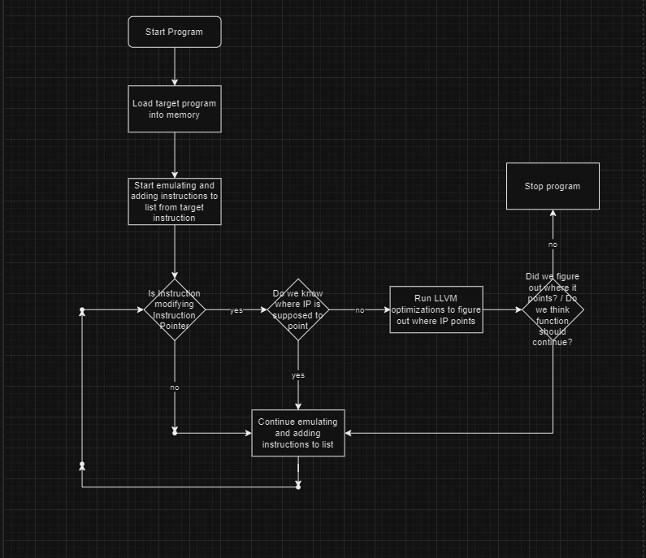

## Examples

This is the practical example to illustrate how Mergen solves against virtualized programs.

1. [VMProtect](#example-1-vmprotect)
2. [Branches/Jumptables](#example-2-branchesjumptables)
3. [Themida 3.1.6.0 LION64 (Red)](#example-3-themida-3160-lion64-red)

### Example #1 (VMProtect)

This is our target program

```cpp
struct test {
    int a;
    int b;
    int c;
};

int maths(test a, int b, int c) {
        return a.a  + b - c;
}
```
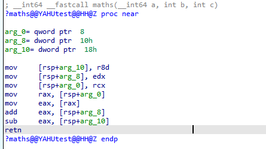

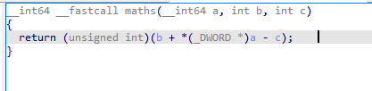

VMProtect settings, everything is turned off, we virtualize the function on ultra setting. (Tested versions 3.4.0-3.6.0 3.8.1)

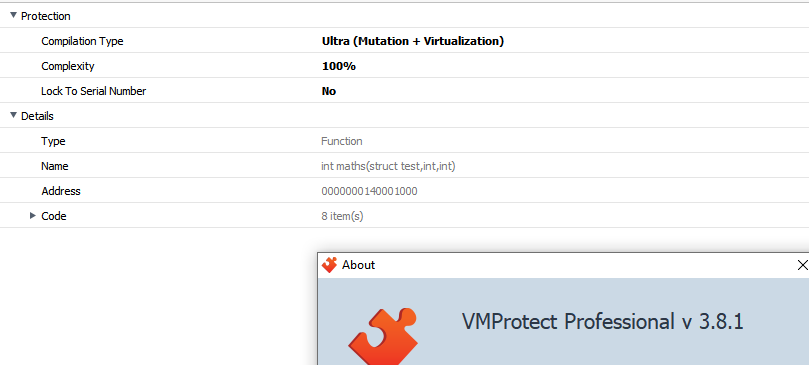

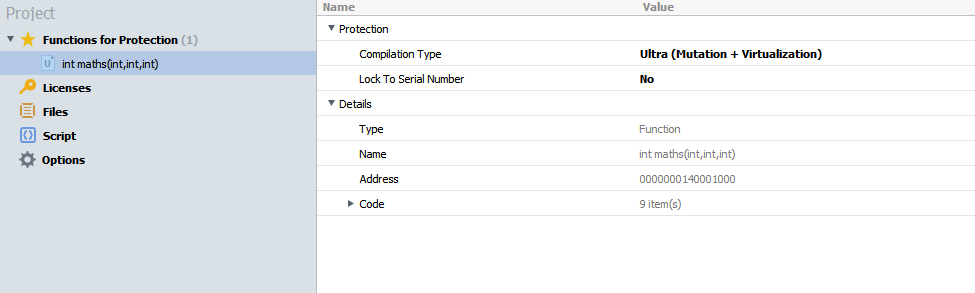

Here, we run mergen. First argument is the name of the file and the second argument is the address of the function. Look how simple it is to run. And we can compile the output so we can explore it using our favorite decompiler.

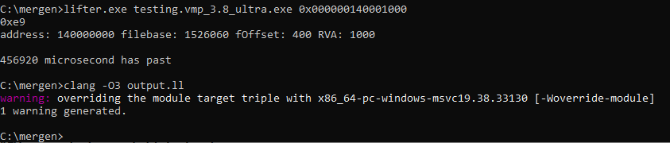

```llvm
; ModuleID = 'my_lifting_module'
source_filename = "my_lifting_module"

; Function Attrs: mustprogress nofree norecurse nosync nounwind willreturn memory(argmem: read)
define i64 @main(i64 %rax, i64 %rcx, i64 %rdx, i64 %rbx, i64 %0, i64 %rbp, i64 %rsi, i64 %rdi, i64 %r8, i64 %r9, i64 %r10, i64 %r11, i64 %r12, i64 %r13, i64 %r14, i64 %r15, ptr nocapture readonly %memory) local_unnamed_addr #0 {
entry:
  %stackmemory = alloca i128, i128 13758960, align 8
  %1 = trunc i64 %r8 to i32
  %2 = trunc i64 %rdx to i32
  %GEPLoadxd-5369456437- = getelementptr i8, ptr %memory, i64 %rcx
  %3 = load i32, ptr %GEPLoadxd-5369456437-, align 4
  %adc-temp-5370242400- = sub i32 %2, %1
  %realnot-5369532059- = add i32 %adc-temp-5370242400-, %3
  %stackmemory10243.sroa.55.1375304.insert.ext10255 = zext i32 %realnot-5369532059- to i64
  ret i64 %stackmemory10243.sroa.55.1375304.insert.ext10255
}

attributes #0 = { mustprogress nofree norecurse nosync nounwind willreturn memory(argmem: read) }
```

After compiling:

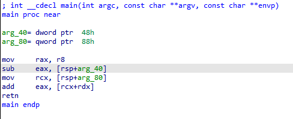

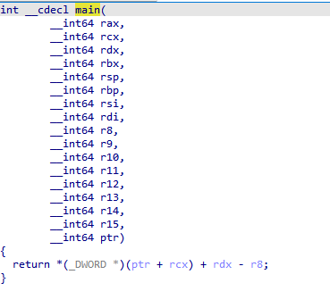

Now you might notice the registers are a little bit off. This is because of we dont follow the calling conventions, if we were to follow the calling conventions, function signature would look like this:
```llvm
define i64 @main(i64 %rcx, i64 %rdx, i64 %rdx, i64 %r8, i64 %r9 ...)
```
So, we just adjust the function signature to look normally. If you have more questions about this part, I suggest you research [calling conventions](https://learn.microsoft.com/en-us/cpp/build/x64-calling-convention?view=msvc-170#parameter-passing) and [ABI](https://learn.microsoft.com/en-us/cpp/build/x64-software-conventions?view=msvc-170&source=recommendations#register-volatility-and-preservation).

## Example #2 (Branches/Jumptables)
So, lets say we have this code. VM's will take the below code then turn it to an indirect jump, its slightly more unconvenient for the reverser.
```cpp
int maths(int a, int b, int c) {
    if (a > b)
        return a + b + c;
    else
        return a - b - c;
}
```


```
next_handler = xxx;
if ( a-b > 0 )
  next_handler = yyy;
jump next_handler;
```

We try to always analyze values and keep track of them. This allows us to understand control flow. 
[For jumptable-like branches](https://github.com/NaC-L/Mergen/blob/experimental-pattern-matching/testcases/test_branches.asm)
Optimized output would be a simple
```llvm
define i64 @main(i64 %rax, i64 %rcx, i64 %rdx, i64 %rbx, i64 %rsp, i64 %rbp, i64 %rsi, i64 %rdi, i64 %r8, i64 %r9, i64 %r10, i64 %r11, i64 %r12, i64 %r13, i64 %r14, i64 %r15, ptr nocapture readnone %TEB, ptr nocapture readnone %memory) local_unnamed_addr #0 {
fake_ret:
  %0 = lshr i64 %rcx, 62
  %common.ret.op = and i64 %0, 2
  ret i64 %common.ret.op
}
```
Unoptimized output. (DCE'd for readability)
```llvm
source_filename = "my_lifting_module"

define i64 @main(i64 %rax, i64 %rcx, i64 %rdx, i64 %rbx, i64 %rsp, i64 %rbp, i64 %rsi, i64 %rdi, i64 %r8, i64 %r9, i64 %r10, i64 %r11, i64 %r12, i64 %r13, i64 %r14, i64 %r15, ptr %TEB, ptr %memory) {
  %lsb = and i64 %rcx, 255
  %pf1 = mul i64 %lsb, 72340172838076673
  %pf2 = and i64 %pf1, -9205322385119247871
  %pf3 = urem i64 %pf2, 511
  %pf4 = and i64 %pf3, 1
  %pf5 = icmp eq i64 0, %pf4
  %0 = zext i1 %pf5 to i64
  %createrflag2 = shl i64 %0, 2
  %creatingrflag = or i64 2, %createrflag2
  %zeroflag = icmp eq i64 %rcx, 0
  %1 = zext i1 %zeroflag to i64
  %createrflag21 = shl i64 %1, 6
  %creatingrflag2 = or i64 %creatingrflag, %createrflag21
  %signflag = icmp slt i64 %rcx, 0
  %2 = zext i1 %signflag to i64
  %createrflag23 = shl i64 %2, 7
  %creatingrflag4 = or i64 %creatingrflag2, %createrflag23
  %GEPSTORE-5368713221- = getelementptr i8, ptr %memory, i64 1376032
  store i64 %creatingrflag4, ptr %GEPSTORE-5368713221-, align 4
  %realand-5368713229- = and i64 %creatingrflag4, 128
  %shr-lshr-5368713233- = lshr i64 %realand-5368713229-, 7
  %3 = mul i64 %shr-lshr-5368713233-, 4
  %bvalue_indexvalue = add i64 5368713249, %3
  %4 = icmp eq i64 %bvalue_indexvalue, 5368713253
  %lolb- = select i1 %4, i64 5368713264, i64 5368713257
  %GEPSTORE-5368713248- = getelementptr i8, ptr %memory, i64 1376032
  store i64 %lolb-, ptr %GEPSTORE-5368713248-, align 4
  br i1 %4, label %real_ret, label %real_ret41

real_ret:                                         ; preds = %fake_ret
  %inc-5368713273- = add i64 %shr-lshr-5368713233-, 1
  ret i64 %inc-5368713273-

real_ret41:                                       ; preds = %fake_ret
  ret i64 %shr-lshr-5368713233-
}
```
Notice this part
```
  %realand-5368713229- = and i64 %creatingrflag4, 128
  %shr-lshr-5368713233- = lshr i64 %realand-5368713229-, 7
```
We get the flags, then we get the 7th bit which is Sign Flag, then we use the Sign Flag to calculate an address. Through analysis, we determine the address could be one of two values, `5368713257` or `5368713264`, then we turn that into a comparison. If address is `5368713257`, take one branch, if other, take another. When doing this, it is also important to mark the condition appopriate value because later, we might need to calculate another jump with the same exact value.  

Even though we solve the indirect jumps, jumps with more than 2 possible location are not supported. This is because the analysis for them are not implemented yet. This allows us to solve the vm-style branches, but have problem with real life jumptables.

### Example #3 (Themida 3.1.6.0 LION64 (Red))
Our target program:

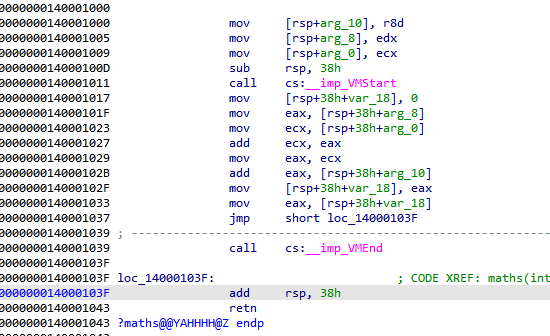

Themida settings (we only care about vms atm):

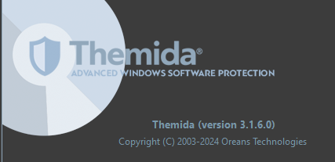

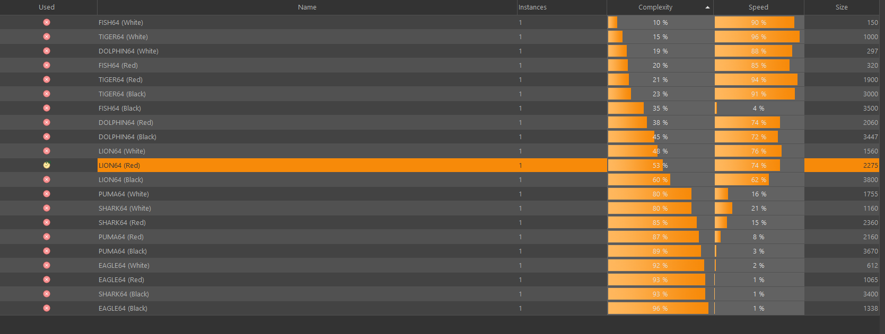

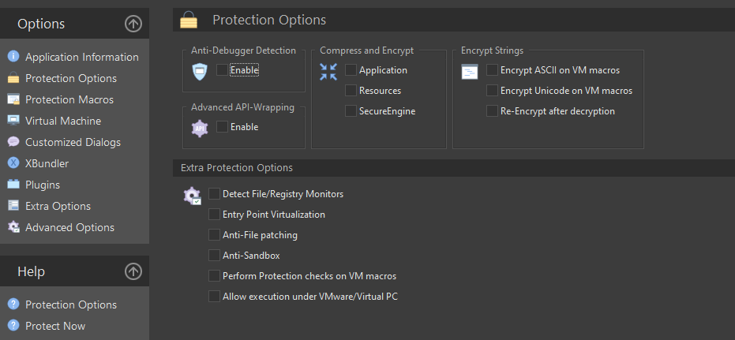

After vm:

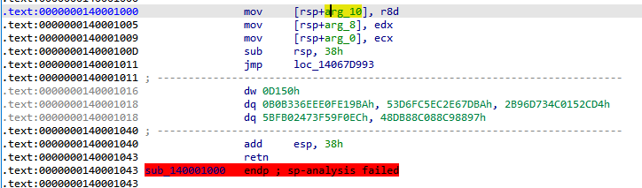

Running Mergen:

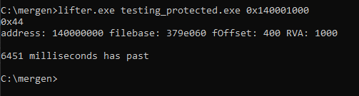

Output code: [click here](docs/themida_output.ll)
So, why our result is not succesful as lifting a binary thats protected by vmp?

Themida actively writes on .themida section. Unlike stack, we cant disregard these writes, because these values might be read by other stuff later.

But, we have a temporary solution to that. Remove all stores into .themida section. Since our program doesnt write into memory, [I just commented all the stores.](docs/themida_output_lazy_fix.ll) Now we are left with this:

```llvm
source_filename = "my_lifting_module"

define i64 @main(i64 %rax, i64 %rcx, i64 %rdx, i64 %rbx, i64 %rsp, i64 %rbp, i64 %rsi, i64 %rdi, i64 %r8, i64 %r9, i64 %r10, i64 %r11, i64 %r12, i64 %r13, i64 %r14, i64 %r15, ptr writeonly %memory) local_unnamed_addr #0 {
  %trunc = trunc i64 %r8 to i32
  %trunc1 = trunc i64 %rdx to i32
  %trunc2 = trunc i64 %rcx to i32
  %realadd-5369771371- = add i32 %trunc1, %trunc2
  %realadd-5369582686- = add i32 %realadd-5369771371-, %trunc
  %trunc457139 = zext i32 %realadd-5369582686- to i64
  ret i64 %trunc457139
}

attributes #0 = { mustprogress nofree norecurse nosync nounwind willreturn memory(argmem: write) }
```
# Technical challenges
- Loops
- Self Modifying Code ( especially with conditional modification)
- Being in an universe where "outlining" and "unrolling" passes doesnt exist. 


# Getting in touch
Join our [Mergen Discord Server](https://discord.gg/e3eftYguqB) to trade ideas or just chatting in general.
