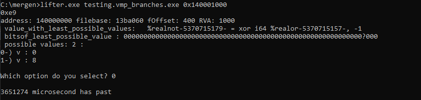
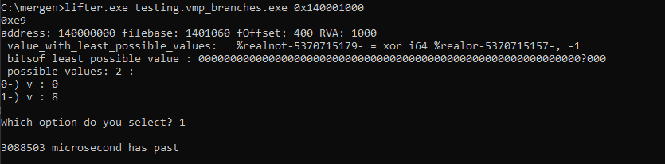

# Project Overview:
Mergen is a tool engineered to convert Assembly code into LLVM Intermediate Representation (IR).
This tool is designed for:
- The deobfuscation or devirtualization of obfuscated binary code
- The enhancement of the reverse engineering process, making it more efficient and effective, especially for complex software systems.

## Building

To build the project, take a look at [**docs/BUILDING.md**](https://github.com/NaC-L/Mergen/blob/main/docs/BUILDING.md).

## Core Objectives:

### Deobfuscation

### Devirtualization

### Optimization

## Diagram


## Examples
### Example #1 (VMProtect)

This is our target program

```cpp
struct test {
    int a;
    int b;
    int c;
};

int maths(test a, int b, int c) {
        return a.a  + b - c;
}
```


VMProtect settings, everything is turned off, we virtualize the function on ultra setting. (Tested versions 3.4.0-3.6.0 3.8.1) 


Here, we run mergen. First argument is the name of the file and the second argument is the address of the function. Look how simple it is to run. And we can compile the output so we can explore it using our favorite decompiler.


```llvm
; ModuleID = 'my_lifting_module'
source_filename = "my_lifting_module"

; Function Attrs: mustprogress nofree norecurse nosync nounwind willreturn memory(argmem: read)
define i64 @main(i64 %rax, i64 %rcx, i64 %rdx, i64 %rbx, i64 %0, i64 %rbp, i64 %rsi, i64 %rdi, i64 %r8, i64 %r9, i64 %r10, i64 %r11, i64 %r12, i64 %r13, i64 %r14, i64 %r15, ptr nocapture readonly %memory) local_unnamed_addr #0 {
entry:
  %stackmemory = alloca i128, i128 13758960, align 8
  %1 = trunc i64 %r8 to i32
  %2 = trunc i64 %rdx to i32
  %GEPLoadxd-5369456437- = getelementptr i8, ptr %memory, i64 %rcx
  %3 = load i32, ptr %GEPLoadxd-5369456437-, align 4
  %adc-temp-5370242400- = sub i32 %2, %1
  %realnot-5369532059- = add i32 %adc-temp-5370242400-, %3
  %stackmemory10243.sroa.55.1375304.insert.ext10255 = zext i32 %realnot-5369532059- to i64
  ret i64 %stackmemory10243.sroa.55.1375304.insert.ext10255
}

attributes #0 = { mustprogress nofree norecurse nosync nounwind willreturn memory(argmem: read) }
```

After compiling:


Now you might notice the registers are a little bit off. This is because of we dont follow the calling conventions, if we were to follow the calling conventions, function signature would look like this:
```llvm
define i64 @main(i64 %rcx, i64 %rdx, i64 %rdx, i64 %r8, i64 %r9 ...) 
```
So, we just adjust the function signature to look normally. If you have more questions about this part, I suggest you research [calling conventions](https://learn.microsoft.com/en-us/cpp/build/x64-calling-convention?view=msvc-170#parameter-passing) and [ABI](https://learn.microsoft.com/en-us/cpp/build/x64-software-conventions?view=msvc-170&source=recommendations#register-volatility-and-preservation).

## Example #2 (Branches/Jumptables)
So, lets say we have this code. VM's will take this, and turn into a jump table so its harder to find the branch.
```cpp
int maths(int a, int b, int c) {
    if (a > b)
        return a + b + c;
    else
        return a - b - c;
}
```

This would be a high level interpretation of it. If you want to see how it really works, you can check [this file](https://github.com/NaC-L/Mergen/blob/main/testcases/test_branches.asm).

```
...
next_handler = xxx;
if ( a-b > 0 )
  next_handler = yyy;
jump next_handler;
...

```
This is how it will look when Mergen is running, it will execute a _very_ simple dependency analysis to find the "key" value and ask you to select a possible value. 


Output will look like this:
```llvm
; ModuleID = 'my_lifting_module'
source_filename = "my_lifting_module"

; Function Attrs: mustprogress nofree norecurse nosync nounwind willreturn memory(none)
define i64 @main(i64 %rax, i64 %rcx, i64 %rdx, i64 %rbx, i64 %rsp, i64 %rbp, i64 %rsi, i64 %rdi, i64 %r8, i64 %r9, i64 %r10, i64 %r11, i64 %r12, i64 %r13, i64 %r14, i64 %r15, ptr nocapture readnone %memory) local_unnamed_addr #0 {
entry:
  %stackmemory = alloca i128, i128 13758960, align 8
  %0 = trunc i64 %r8 to i32
  %1 = trunc i64 %rdx to i32
  %2 = trunc i64 %rcx to i32
  %adc-temp-5369455735- = add i32 %1, %2
  %realadd-5370894038- = add i32 %adc-temp-5369455735-, %0
  %stackmemory28430.sroa.2082.1375248.insert.ext = zext i32 %realadd-5370894038- to i64
  ret i64 %stackmemory28430.sroa.2082.1375248.insert.ext
}

attributes #0 = { mustprogress nofree norecurse nosync nounwind willreturn memory(none) }
```

Now, lets see what happens if we choose the other path:


```llvm
; ModuleID = 'my_lifting_module'
source_filename = "my_lifting_module"

; Function Attrs: mustprogress nofree norecurse nosync nounwind willreturn memory(none)
define i64 @main(i64 %rax, i64 %rcx, i64 %rdx, i64 %rbx, i64 %rsp, i64 %rbp, i64 %rsi, i64 %rdi, i64 %r8, i64 %r9, i64 %r10, i64 %r11, i64 %r12, i64 %r13, i64 %r14, i64 %r15, ptr nocapture readnone %memory) local_unnamed_addr #0 {
entry:
  %stackmemory = alloca i128, i128 13758960, align 8
  %0 = trunc i64 %r8 to i32
  %1 = trunc i64 %rdx to i32
  %2 = trunc i64 %rcx to i32
  %3 = add i32 %1, %0
  %realnot-5370192942- = sub i32 %2, %3
  %stackmemory28817.sroa.3072.1375144.insert.ext = zext i32 %realnot-5370192942- to i64
  ret i64 %stackmemory28817.sroa.3072.1375144.insert.ext
}

attributes #0 = { mustprogress nofree norecurse nosync nounwind willreturn memory(none) }
```

We managed to restore the original logic for branches. Next step would be tying these two paths into one. I do believe using SwitchInst would be more effective for this.

### Example #3 (Themida 3.1.6.0 LION64 (Red) )
Our target program:


Themida settings (we only care about vms atm):


After vm:


Running Mergen:


Output code:
```llvm
; ModuleID = 'my_lifting_module'
source_filename = "my_lifting_module"

; Function Attrs: mustprogress nofree norecurse nosync nounwind willreturn memory(argmem: write)
define i64 @main(i64 %rax, i64 %rcx, i64 %rdx, i64 %rbx, i64 %rsp, i64 %rbp, i64 %rsi, i64 %rdi, i64 %r8, i64 %r9, i64 %r10, i64 %r11, i64 %r12, i64 %r13, i64 %r14, i64 %r15, ptr writeonly %memory) local_unnamed_addr #0 {
entry:
  %stackmemory = alloca i128, i128 13758960, align 8
  %trunc = trunc i64 %r8 to i32
  %trunc1 = trunc i64 %rdx to i32
  %trunc2 = trunc i64 %rcx to i32
  %GEPLoadxd--328 = getelementptr i8, ptr %memory, i64 5368834253
  store i32 1, ptr %GEPLoadxd--328, align 4
  %GEPSTORE-5371286539- = getelementptr i8, ptr %memory, i64 5368834165
  store i64 5368709120, ptr %GEPSTORE-5371286539-, align 4
  %GEPSTORE-5371287242- = getelementptr i8, ptr %memory, i64 5369125476
  store i64 4119, ptr %GEPSTORE-5371287242-, align 4
  %GEPSTORE-5371287530- = getelementptr i8, ptr %memory, i64 5368833904
  store i64 5369125476, ptr %GEPSTORE-5371287530-, align 4
  %GEPSTORE-5371287719- = getelementptr i8, ptr %memory, i64 5368834083
  store i64 %rbp, ptr %GEPSTORE-5371287719-, align 4
  %GEPSTORE-5371287918- = getelementptr i8, ptr %memory, i64 5368834026
  store i64 5375518127, ptr %GEPSTORE-5371287918-, align 4
  %GEPLoadxd--426 = getelementptr i8, ptr %memory, i64 5368833996
  %GEPLoadxd--472 = getelementptr i8, ptr %memory, i64 5370995040
  store i64 5369127880, ptr %GEPLoadxd--472, align 4
  %GEPLoadxd--484 = getelementptr i8, ptr %memory, i64 5370995048
  store i64 5369127885, ptr %GEPLoadxd--484, align 4
  %GEPLoadxd--498 = getelementptr i8, ptr %memory, i64 5370995056
  store i64 5369125492, ptr %GEPLoadxd--498, align 4
  %GEPLoadxd--512 = getelementptr i8, ptr %memory, i64 5370995064
  store i64 5369125497, ptr %GEPLoadxd--512, align 4
  %GEPLoadxd--526 = getelementptr i8, ptr %memory, i64 5370995072
  store i64 5368814018, ptr %GEPLoadxd--526, align 4
  %GEPLoadxd--540 = getelementptr i8, ptr %memory, i64 5370995080
  store i64 5368814023, ptr %GEPLoadxd--540, align 4
  %GEPLoadxd--554 = getelementptr i8, ptr %memory, i64 5370995088
  store i64 5369012878, ptr %GEPLoadxd--554, align 4
  %GEPLoadxd--568 = getelementptr i8, ptr %memory, i64 5370995096
  store i64 5369012883, ptr %GEPLoadxd--568, align 4
  %GEPLoadxd--582 = getelementptr i8, ptr %memory, i64 5370995104
  store i64 5368836724, ptr %GEPLoadxd--582, align 4
  %GEPLoadxd--596 = getelementptr i8, ptr %memory, i64 5370995112
  store i64 5368836729, ptr %GEPLoadxd--596, align 4
  %GEPLoadxd--610 = getelementptr i8, ptr %memory, i64 5370995120
  store i64 5369029756, ptr %GEPLoadxd--610, align 4
  %GEPLoadxd--624 = getelementptr i8, ptr %memory, i64 5370995128
  store i64 5369029761, ptr %GEPLoadxd--624, align 4
  %GEPLoadxd--638 = getelementptr i8, ptr %memory, i64 5370995136
  store i64 5368885864, ptr %GEPLoadxd--638, align 4
  %GEPLoadxd--652 = getelementptr i8, ptr %memory, i64 5370995144
  store i64 5368885869, ptr %GEPLoadxd--652, align 4
  %GEPLoadxd--666 = getelementptr i8, ptr %memory, i64 5370995152
  store i64 5368864026, ptr %GEPLoadxd--666, align 4
  %GEPLoadxd--680 = getelementptr i8, ptr %memory, i64 5370995160
  store i64 5368864031, ptr %GEPLoadxd--680, align 4
  %GEPLoadxd--694 = getelementptr i8, ptr %memory, i64 5370995168
  store i64 5368847456, ptr %GEPLoadxd--694, align 4
  %GEPLoadxd--708 = getelementptr i8, ptr %memory, i64 5370995176
  store i64 5368847461, ptr %GEPLoadxd--708, align 4
  %GEPLoadxd--722 = getelementptr i8, ptr %memory, i64 5370995184
  store i64 5368836554, ptr %GEPLoadxd--722, align 4
  %GEPLoadxd--736 = getelementptr i8, ptr %memory, i64 5370995192
  store i64 5368836559, ptr %GEPLoadxd--736, align 4
  %GEPLoadxd--750 = getelementptr i8, ptr %memory, i64 5370995200
  store i64 5368799128, ptr %GEPLoadxd--750, align 4
  %GEPLoadxd--764 = getelementptr i8, ptr %memory, i64 5370995208
  store i64 5368799133, ptr %GEPLoadxd--764, align 4
  %GEPLoadxd--778 = getelementptr i8, ptr %memory, i64 5370995216
  store i64 5368836504, ptr %GEPLoadxd--778, align 4
  %GEPLoadxd--792 = getelementptr i8, ptr %memory, i64 5370995224
  store i64 5368836509, ptr %GEPLoadxd--792, align 4
  %GEPLoadxd--806 = getelementptr i8, ptr %memory, i64 5370995232
  store i64 5368972406, ptr %GEPLoadxd--806, align 4
  %GEPLoadxd--820 = getelementptr i8, ptr %memory, i64 5370995240
  store i64 5368972411, ptr %GEPLoadxd--820, align 4
  %GEPLoadxd--834 = getelementptr i8, ptr %memory, i64 5370995248
  store i64 5368847710, ptr %GEPLoadxd--834, align 4
  %GEPLoadxd--848 = getelementptr i8, ptr %memory, i64 5370995256
  store i64 5368847715, ptr %GEPLoadxd--848, align 4
  %GEPLoadxd--862 = getelementptr i8, ptr %memory, i64 5370995264
  store i64 5369016830, ptr %GEPLoadxd--862, align 4
  %GEPLoadxd--876 = getelementptr i8, ptr %memory, i64 5370995272
  store i64 5369016835, ptr %GEPLoadxd--876, align 4
  %GEPLoadxd--890 = getelementptr i8, ptr %memory, i64 5370995280
  store i64 5369016820, ptr %GEPLoadxd--890, align 4
  %GEPLoadxd--904 = getelementptr i8, ptr %memory, i64 5370995288
  store i64 5369016825, ptr %GEPLoadxd--904, align 4
  %GEPLoadxd--918 = getelementptr i8, ptr %memory, i64 5370995296
  store i64 5368964876, ptr %GEPLoadxd--918, align 4
  %GEPLoadxd--932 = getelementptr i8, ptr %memory, i64 5370995304
  store i64 5368964881, ptr %GEPLoadxd--932, align 4
  %GEPLoadxd--946 = getelementptr i8, ptr %memory, i64 5370995312
  store i64 5368835166, ptr %GEPLoadxd--946, align 4
  %GEPLoadxd--960 = getelementptr i8, ptr %memory, i64 5370995320
  store i64 5368835171, ptr %GEPLoadxd--960, align 4
  %GEPLoadxd--974 = getelementptr i8, ptr %memory, i64 5370995328
  store i64 5368964866, ptr %GEPLoadxd--974, align 4
  %GEPLoadxd--988 = getelementptr i8, ptr %memory, i64 5370995336
  store i64 5368964871, ptr %GEPLoadxd--988, align 4
  %GEPLoadxd--1002 = getelementptr i8, ptr %memory, i64 5370995344
  store i64 5369153536, ptr %GEPLoadxd--1002, align 4
  %GEPLoadxd--1016 = getelementptr i8, ptr %memory, i64 5370995352
  store i64 5369153541, ptr %GEPLoadxd--1016, align 4
  %GEPLoadxd--1030 = getelementptr i8, ptr %memory, i64 5370995360
  store i64 5369016810, ptr %GEPLoadxd--1030, align 4
  %GEPLoadxd--1044 = getelementptr i8, ptr %memory, i64 5370995368
  store i64 5369016815, ptr %GEPLoadxd--1044, align 4
  %GEPLoadxd--1058 = getelementptr i8, ptr %memory, i64 5370995376
  store i64 5369154510, ptr %GEPLoadxd--1058, align 4
  %GEPLoadxd--1072 = getelementptr i8, ptr %memory, i64 5370995384
  store i64 5369154515, ptr %GEPLoadxd--1072, align 4
  %GEPLoadxd--1086 = getelementptr i8, ptr %memory, i64 5370995392
  store i64 5368799158, ptr %GEPLoadxd--1086, align 4
  %GEPLoadxd--1100 = getelementptr i8, ptr %memory, i64 5370995400
  store i64 5368799163, ptr %GEPLoadxd--1100, align 4
  %GEPLoadxd--1114 = getelementptr i8, ptr %memory, i64 5370995408
  store i64 5368836514, ptr %GEPLoadxd--1114, align 4
  %GEPLoadxd--1128 = getelementptr i8, ptr %memory, i64 5370995416
  store i64 5368836519, ptr %GEPLoadxd--1128, align 4
  %GEPLoadxd--1142 = getelementptr i8, ptr %memory, i64 5370995424
  store i64 5368799138, ptr %GEPLoadxd--1142, align 4
  %GEPLoadxd--1156 = getelementptr i8, ptr %memory, i64 5370995432
  store i64 5368799143, ptr %GEPLoadxd--1156, align 4
  %GEPLoadxd--1170 = getelementptr i8, ptr %memory, i64 5370995440
  store i64 5368993706, ptr %GEPLoadxd--1170, align 4
  %GEPLoadxd--1184 = getelementptr i8, ptr %memory, i64 5370995448
  store i64 5368993711, ptr %GEPLoadxd--1184, align 4
  %GEPLoadxd--1198 = getelementptr i8, ptr %memory, i64 5370995456
  store i64 5368799148, ptr %GEPLoadxd--1198, align 4
  %GEPLoadxd--1212 = getelementptr i8, ptr %memory, i64 5370995464
  store i64 5368799153, ptr %GEPLoadxd--1212, align 4
  %GEPLoadxd--1226 = getelementptr i8, ptr %memory, i64 5370995472
  store i64 5368836534, ptr %GEPLoadxd--1226, align 4
  %GEPLoadxd--1240 = getelementptr i8, ptr %memory, i64 5370995480
  store i64 5368836539, ptr %GEPLoadxd--1240, align 4
  %GEPLoadxd--1254 = getelementptr i8, ptr %memory, i64 5370995488
  store i64 5368836914, ptr %GEPLoadxd--1254, align 4
  %GEPLoadxd--1268 = getelementptr i8, ptr %memory, i64 5370995496
  store i64 5368836919, ptr %GEPLoadxd--1268, align 4
  %GEPLoadxd--1282 = getelementptr i8, ptr %memory, i64 5370995504
  store i64 5368799288, ptr %GEPLoadxd--1282, align 4
  %GEPLoadxd--1296 = getelementptr i8, ptr %memory, i64 5370995512
  store i64 5368799293, ptr %GEPLoadxd--1296, align 4
  %GEPLoadxd--1310 = getelementptr i8, ptr %memory, i64 5370995520
  store i64 5369134478, ptr %GEPLoadxd--1310, align 4
  %GEPLoadxd--1324 = getelementptr i8, ptr %memory, i64 5370995528
  store i64 5369134483, ptr %GEPLoadxd--1324, align 4
  %GEPLoadxd--1338 = getelementptr i8, ptr %memory, i64 5370995536
  store i64 5369004210, ptr %GEPLoadxd--1338, align 4
  %GEPLoadxd--1352 = getelementptr i8, ptr %memory, i64 5370995544
  store i64 5369004215, ptr %GEPLoadxd--1352, align 4
  %GEPLoadxd--1366 = getelementptr i8, ptr %memory, i64 5370995552
  store i64 5368796668, ptr %GEPLoadxd--1366, align 4
  %GEPLoadxd--1380 = getelementptr i8, ptr %memory, i64 5370995560
  store i64 5368796673, ptr %GEPLoadxd--1380, align 4
  %GEPLoadxd--1394 = getelementptr i8, ptr %memory, i64 5370995568
  store i64 5369027906, ptr %GEPLoadxd--1394, align 4
  %GEPLoadxd--1408 = getelementptr i8, ptr %memory, i64 5370995576
  store i64 5369027911, ptr %GEPLoadxd--1408, align 4
  %GEPLoadxd--1422 = getelementptr i8, ptr %memory, i64 5370995584
  store i64 5369028416, ptr %GEPLoadxd--1422, align 4
  %GEPLoadxd--1436 = getelementptr i8, ptr %memory, i64 5370995592
  store i64 5369028421, ptr %GEPLoadxd--1436, align 4
  %GEPLoadxd--1450 = getelementptr i8, ptr %memory, i64 5370995600
  store i64 5369154090, ptr %GEPLoadxd--1450, align 4
  %GEPLoadxd--1464 = getelementptr i8, ptr %memory, i64 5370995608
  store i64 5369154095, ptr %GEPLoadxd--1464, align 4
  %GEPLoadxd--1478 = getelementptr i8, ptr %memory, i64 5370995616
  store i64 5368836524, ptr %GEPLoadxd--1478, align 4
  %GEPLoadxd--1492 = getelementptr i8, ptr %memory, i64 5370995624
  store i64 5368836529, ptr %GEPLoadxd--1492, align 4
  %GEPLoadxd--1506 = getelementptr i8, ptr %memory, i64 5370995632
  store i64 5368993946, ptr %GEPLoadxd--1506, align 4
  %GEPLoadxd--1520 = getelementptr i8, ptr %memory, i64 5370995640
  store i64 5368993951, ptr %GEPLoadxd--1520, align 4
  %GEPLoadxd--1534 = getelementptr i8, ptr %memory, i64 5370995648
  store i64 5368836544, ptr %GEPLoadxd--1534, align 4
  %GEPLoadxd--1548 = getelementptr i8, ptr %memory, i64 5370995656
  store i64 5368836549, ptr %GEPLoadxd--1548, align 4
  %GEPLoadxd--1562 = getelementptr i8, ptr %memory, i64 5370995664
  store i64 5369154080, ptr %GEPLoadxd--1562, align 4
  %GEPLoadxd--1576 = getelementptr i8, ptr %memory, i64 5370995672
  store i64 5369154085, ptr %GEPLoadxd--1576, align 4
  %GEPLoadxd--1590 = getelementptr i8, ptr %memory, i64 5370995680
  store i64 5368848226, ptr %GEPLoadxd--1590, align 4
  %GEPLoadxd--1604 = getelementptr i8, ptr %memory, i64 5370995688
  store i64 5368848231, ptr %GEPLoadxd--1604, align 4
  %GEPLoadxd--1618 = getelementptr i8, ptr %memory, i64 5370995696
  store i64 5369141268, ptr %GEPLoadxd--1618, align 4
  %GEPLoadxd--1632 = getelementptr i8, ptr %memory, i64 5370995704
  store i64 5369141273, ptr %GEPLoadxd--1632, align 4
  %GEPLoadxd--1646 = getelementptr i8, ptr %memory, i64 5370995712
  store i64 5369154070, ptr %GEPLoadxd--1646, align 4
  %GEPLoadxd--1660 = getelementptr i8, ptr %memory, i64 5370995720
  store i64 5369154075, ptr %GEPLoadxd--1660, align 4
  %GEPLoadxd--1674 = getelementptr i8, ptr %memory, i64 5370995728
  store i64 5369154060, ptr %GEPLoadxd--1674, align 4
  %GEPLoadxd--1688 = getelementptr i8, ptr %memory, i64 5370995736
  store i64 5369154065, ptr %GEPLoadxd--1688, align 4
  %GEPLoadxd--1702 = getelementptr i8, ptr %memory, i64 5370995744
  store i64 5369153546, ptr %GEPLoadxd--1702, align 4
  %GEPLoadxd--1716 = getelementptr i8, ptr %memory, i64 5370995752
  store i64 5369153551, ptr %GEPLoadxd--1716, align 4
  %GEPLoadxd--1730 = getelementptr i8, ptr %memory, i64 5370995760
  store i64 5369127950, ptr %GEPLoadxd--1730, align 4
  %GEPLoadxd--1744 = getelementptr i8, ptr %memory, i64 5370995768
  store i64 5369127955, ptr %GEPLoadxd--1744, align 4
  %GEPLoadxd--1758 = getelementptr i8, ptr %memory, i64 5370995776
  store i64 5369135128, ptr %GEPLoadxd--1758, align 4
  %GEPLoadxd--1772 = getelementptr i8, ptr %memory, i64 5370995784
  store i64 5369135133, ptr %GEPLoadxd--1772, align 4
  %GEPLoadxd--1786 = getelementptr i8, ptr %memory, i64 5370995792
  store i64 5369127940, ptr %GEPLoadxd--1786, align 4
  %GEPLoadxd--1800 = getelementptr i8, ptr %memory, i64 5370995800
  store i64 5369127945, ptr %GEPLoadxd--1800, align 4
  %GEPLoadxd--1814 = getelementptr i8, ptr %memory, i64 5370995808
  store i64 5369127750, ptr %GEPLoadxd--1814, align 4
  %GEPLoadxd--1828 = getelementptr i8, ptr %memory, i64 5370995816
  store i64 5369127755, ptr %GEPLoadxd--1828, align 4
  %GEPLoadxd--1842 = getelementptr i8, ptr %memory, i64 5370995824
  store i64 5369027406, ptr %GEPLoadxd--1842, align 4
  %GEPLoadxd--1856 = getelementptr i8, ptr %memory, i64 5370995832
  store i64 5369027411, ptr %GEPLoadxd--1856, align 4
  %GEPLoadxd--1870 = getelementptr i8, ptr %memory, i64 5370995840
  store i64 5369033766, ptr %GEPLoadxd--1870, align 4
  %GEPLoadxd--1884 = getelementptr i8, ptr %memory, i64 5370995848
  store i64 5369033771, ptr %GEPLoadxd--1884, align 4
  %GEPLoadxd--1898 = getelementptr i8, ptr %memory, i64 5370995856
  store i64 5369128508, ptr %GEPLoadxd--1898, align 4
  %GEPLoadxd--1912 = getelementptr i8, ptr %memory, i64 5370995864
  store i64 5369128513, ptr %GEPLoadxd--1912, align 4
  %GEPLoadxd--1926 = getelementptr i8, ptr %memory, i64 5370995872
  store i64 5369128232, ptr %GEPLoadxd--1926, align 4
  %GEPLoadxd--1940 = getelementptr i8, ptr %memory, i64 5370995880
  store i64 5369128237, ptr %GEPLoadxd--1940, align 4
  %GEPLoadxd--1954 = getelementptr i8, ptr %memory, i64 5370995888
  store i64 5368991036, ptr %GEPLoadxd--1954, align 4
  %GEPLoadxd--1968 = getelementptr i8, ptr %memory, i64 5370995896
  store i64 5368991041, ptr %GEPLoadxd--1968, align 4
  %GEPLoadxd--1982 = getelementptr i8, ptr %memory, i64 5370995904
  store i64 5368991026, ptr %GEPLoadxd--1982, align 4
  %GEPLoadxd--1996 = getelementptr i8, ptr %memory, i64 5370995912
  store i64 5368991031, ptr %GEPLoadxd--1996, align 4
  %GEPLoadxd--2010 = getelementptr i8, ptr %memory, i64 5370995920
  store i64 5368991016, ptr %GEPLoadxd--2010, align 4
  %GEPLoadxd--2024 = getelementptr i8, ptr %memory, i64 5370995928
  store i64 5368991021, ptr %GEPLoadxd--2024, align 4
  %GEPLoadxd--2038 = getelementptr i8, ptr %memory, i64 5370995936
  store i64 5368959496, ptr %GEPLoadxd--2038, align 4
  %GEPLoadxd--2052 = getelementptr i8, ptr %memory, i64 5370995944
  store i64 5368959501, ptr %GEPLoadxd--2052, align 4
  %GEPLoadxd--2066 = getelementptr i8, ptr %memory, i64 5370995952
  store i64 5368848356, ptr %GEPLoadxd--2066, align 4
  %GEPLoadxd--2080 = getelementptr i8, ptr %memory, i64 5370995960
  store i64 5368848361, ptr %GEPLoadxd--2080, align 4
  %GEPLoadxd--2094 = getelementptr i8, ptr %memory, i64 5370995968
  store i64 5368848366, ptr %GEPLoadxd--2094, align 4
  %GEPLoadxd--2108 = getelementptr i8, ptr %memory, i64 5370995976
  store i64 5368848371, ptr %GEPLoadxd--2108, align 4
  %GEPLoadxd--2122 = getelementptr i8, ptr %memory, i64 5370995984
  store i64 5368848376, ptr %GEPLoadxd--2122, align 4
  %GEPLoadxd--2136 = getelementptr i8, ptr %memory, i64 5370995992
  store i64 5368848381, ptr %GEPLoadxd--2136, align 4
  %GEPLoadxd--2150 = getelementptr i8, ptr %memory, i64 5370996000
  store i64 5368860816, ptr %GEPLoadxd--2150, align 4
  %GEPLoadxd--2164 = getelementptr i8, ptr %memory, i64 5370996008
  store i64 5368860821, ptr %GEPLoadxd--2164, align 4
  %GEPLoadxd--2178 = getelementptr i8, ptr %memory, i64 5370996016
  store i64 5368961136, ptr %GEPLoadxd--2178, align 4
  %GEPLoadxd--2192 = getelementptr i8, ptr %memory, i64 5370996024
  store i64 5368961141, ptr %GEPLoadxd--2192, align 4
  %GEPLoadxd--2206 = getelementptr i8, ptr %memory, i64 5370996032
  store i64 5369016840, ptr %GEPLoadxd--2206, align 4
  %GEPLoadxd--2220 = getelementptr i8, ptr %memory, i64 5370996040
  store i64 5369016845, ptr %GEPLoadxd--2220, align 4
  %GEPLoadxd--2234 = getelementptr i8, ptr %memory, i64 5370996048
  store i64 5369026996, ptr %GEPLoadxd--2234, align 4
  %GEPLoadxd--2248 = getelementptr i8, ptr %memory, i64 5370996056
  store i64 5369027001, ptr %GEPLoadxd--2248, align 4
  %GEPLoadxd--2262 = getelementptr i8, ptr %memory, i64 5370996064
  store i64 5368847416, ptr %GEPLoadxd--2262, align 4
  %GEPLoadxd--2276 = getelementptr i8, ptr %memory, i64 5370996072
  store i64 5368847421, ptr %GEPLoadxd--2276, align 4
  %GEPLoadxd--2290 = getelementptr i8, ptr %memory, i64 5370996080
  store i64 5368847426, ptr %GEPLoadxd--2290, align 4
  %GEPLoadxd--2304 = getelementptr i8, ptr %memory, i64 5370996088
  store i64 5368847431, ptr %GEPLoadxd--2304, align 4
  %GEPLoadxd--2318 = getelementptr i8, ptr %memory, i64 5370996096
  store i64 5368970736, ptr %GEPLoadxd--2318, align 4
  %GEPLoadxd--2332 = getelementptr i8, ptr %memory, i64 5370996104
  store i64 5368970741, ptr %GEPLoadxd--2332, align 4
  %GEPLoadxd--2346 = getelementptr i8, ptr %memory, i64 5370996112
  store i64 5368949804, ptr %GEPLoadxd--2346, align 4
  %GEPLoadxd--2360 = getelementptr i8, ptr %memory, i64 5370996120
  store i64 5368949809, ptr %GEPLoadxd--2360, align 4
  %GEPLoadxd--2374 = getelementptr i8, ptr %memory, i64 5370996128
  store i64 5368847446, ptr %GEPLoadxd--2374, align 4
  %GEPLoadxd--2388 = getelementptr i8, ptr %memory, i64 5370996136
  store i64 5368847451, ptr %GEPLoadxd--2388, align 4
  %GEPLoadxd--2402 = getelementptr i8, ptr %memory, i64 5370996144
  store i64 5368847406, ptr %GEPLoadxd--2402, align 4
  %GEPLoadxd--2416 = getelementptr i8, ptr %memory, i64 5370996152
  store i64 5368847411, ptr %GEPLoadxd--2416, align 4
  %GEPLoadxd--2430 = getelementptr i8, ptr %memory, i64 5370996160
  store i64 5368847436, ptr %GEPLoadxd--2430, align 4
  %GEPLoadxd--2444 = getelementptr i8, ptr %memory, i64 5370996168
  store i64 5368847441, ptr %GEPLoadxd--2444, align 4
  %GEPLoadxd--2458 = getelementptr i8, ptr %memory, i64 5370996176
  store i64 5368944446, ptr %GEPLoadxd--2458, align 4
  %GEPLoadxd--2472 = getelementptr i8, ptr %memory, i64 5370996184
  store i64 5368944451, ptr %GEPLoadxd--2472, align 4
  %GEPLoadxd--2486 = getelementptr i8, ptr %memory, i64 5370996192
  store i64 5369124326, ptr %GEPLoadxd--2486, align 4
  %GEPLoadxd--2500 = getelementptr i8, ptr %memory, i64 5370996200
  store i64 5369124331, ptr %GEPLoadxd--2500, align 4
  %GEPLoadxd--2514 = getelementptr i8, ptr %memory, i64 5370996208
  store i64 5368836494, ptr %GEPLoadxd--2514, align 4
  %GEPLoadxd--2528 = getelementptr i8, ptr %memory, i64 5370996216
  store i64 5368836499, ptr %GEPLoadxd--2528, align 4
  %GEPLoadxd--2542 = getelementptr i8, ptr %memory, i64 5370996224
  store i64 5369122966, ptr %GEPLoadxd--2542, align 4
  %GEPLoadxd--2556 = getelementptr i8, ptr %memory, i64 5370996232
  store i64 5369122971, ptr %GEPLoadxd--2556, align 4
  %GEPLoadxd--2570 = getelementptr i8, ptr %memory, i64 5370996240
  store i64 5369124336, ptr %GEPLoadxd--2570, align 4
  %GEPLoadxd--2584 = getelementptr i8, ptr %memory, i64 5370996248
  store i64 5369124341, ptr %GEPLoadxd--2584, align 4
  %GEPLoadxd--2598 = getelementptr i8, ptr %memory, i64 5370996256
  store i64 5369124346, ptr %GEPLoadxd--2598, align 4
  %GEPLoadxd--2612 = getelementptr i8, ptr %memory, i64 5370996264
  store i64 5369124351, ptr %GEPLoadxd--2612, align 4
  %GEPLoadxd--2626 = getelementptr i8, ptr %memory, i64 5370996272
  store i64 5368757380, ptr %GEPLoadxd--2626, align 4
  %GEPLoadxd--2640 = getelementptr i8, ptr %memory, i64 5370996280
  store i64 5368757385, ptr %GEPLoadxd--2640, align 4
  %GEPLoadxd--2654 = getelementptr i8, ptr %memory, i64 5370996288
  store i64 5368935176, ptr %GEPLoadxd--2654, align 4
  %GEPLoadxd--2668 = getelementptr i8, ptr %memory, i64 5370996296
  store i64 5368935181, ptr %GEPLoadxd--2668, align 4
  %GEPLoadxd--2682 = getelementptr i8, ptr %memory, i64 5370996304
  store i64 5368923176, ptr %GEPLoadxd--2682, align 4
  %GEPLoadxd--2696 = getelementptr i8, ptr %memory, i64 5370996312
  store i64 5368923181, ptr %GEPLoadxd--2696, align 4
  %GEPLoadxd--2710 = getelementptr i8, ptr %memory, i64 5370996320
  store i64 5368795840, ptr %GEPLoadxd--2710, align 4
  %GEPLoadxd--2724 = getelementptr i8, ptr %memory, i64 5370996328
  store i64 5368795845, ptr %GEPLoadxd--2724, align 4
  %GEPLoadxd--2738 = getelementptr i8, ptr %memory, i64 5370996336
  store i64 5369000016, ptr %GEPLoadxd--2738, align 4
  %GEPLoadxd--2752 = getelementptr i8, ptr %memory, i64 5370996344
  store i64 5369000021, ptr %GEPLoadxd--2752, align 4
  %GEPLoadxd--2766 = getelementptr i8, ptr %memory, i64 5370996352
  store i64 5368847886, ptr %GEPLoadxd--2766, align 4
  %GEPLoadxd--2780 = getelementptr i8, ptr %memory, i64 5370996360
  store i64 5368847891, ptr %GEPLoadxd--2780, align 4
  %GEPLoadxd--2794 = getelementptr i8, ptr %memory, i64 5370996368
  store i64 5368837164, ptr %GEPLoadxd--2794, align 4
  %GEPLoadxd--2808 = getelementptr i8, ptr %memory, i64 5370996376
  store i64 5368837169, ptr %GEPLoadxd--2808, align 4
  %GEPLoadxd--2822 = getelementptr i8, ptr %memory, i64 5370996384
  store i64 5368884604, ptr %GEPLoadxd--2822, align 4
  %GEPLoadxd--2836 = getelementptr i8, ptr %memory, i64 5370996392
  store i64 5368884609, ptr %GEPLoadxd--2836, align 4
  %GEPLoadxd--2850 = getelementptr i8, ptr %memory, i64 5370996400
  store i64 5368798648, ptr %GEPLoadxd--2850, align 4
  %GEPLoadxd--2864 = getelementptr i8, ptr %memory, i64 5370996408
  store i64 5368798653, ptr %GEPLoadxd--2864, align 4
  %GEPLoadxd--2878 = getelementptr i8, ptr %memory, i64 5370996416
  store i64 5369128212, ptr %GEPLoadxd--2878, align 4
  %GEPLoadxd--2892 = getelementptr i8, ptr %memory, i64 5370996424
  store i64 5369128217, ptr %GEPLoadxd--2892, align 4
  %GEPLoadxd--2906 = getelementptr i8, ptr %memory, i64 5370996432
  store i64 5368859646, ptr %GEPLoadxd--2906, align 4
  %GEPLoadxd--2920 = getelementptr i8, ptr %memory, i64 5370996440
  store i64 5368859651, ptr %GEPLoadxd--2920, align 4
  %GEPLoadxd--2934 = getelementptr i8, ptr %memory, i64 5370996448
  store i64 5369128222, ptr %GEPLoadxd--2934, align 4
  %GEPLoadxd--2948 = getelementptr i8, ptr %memory, i64 5370996456
  store i64 5369128227, ptr %GEPLoadxd--2948, align 4
  %GEPLoadxd--2962 = getelementptr i8, ptr %memory, i64 5370996464
  store i64 5368827624, ptr %GEPLoadxd--2962, align 4
  %GEPLoadxd--2976 = getelementptr i8, ptr %memory, i64 5370996472
  store i64 5368827629, ptr %GEPLoadxd--2976, align 4
  %GEPLoadxd--2990 = getelementptr i8, ptr %memory, i64 5370996480
  store i64 5369153298, ptr %GEPLoadxd--2990, align 4
  %GEPLoadxd--3004 = getelementptr i8, ptr %memory, i64 5370996488
  store i64 5369153303, ptr %GEPLoadxd--3004, align 4
  %GEPLoadxd--3018 = getelementptr i8, ptr %memory, i64 5370996496
  store i64 5369128192, ptr %GEPLoadxd--3018, align 4
  %GEPLoadxd--3032 = getelementptr i8, ptr %memory, i64 5370996504
  store i64 5369128197, ptr %GEPLoadxd--3032, align 4
  %GEPLoadxd--3046 = getelementptr i8, ptr %memory, i64 5370996512
  store i64 5368952254, ptr %GEPLoadxd--3046, align 4
  %GEPLoadxd--3060 = getelementptr i8, ptr %memory, i64 5370996520
  store i64 5368952259, ptr %GEPLoadxd--3060, align 4
  %GEPLoadxd--3074 = getelementptr i8, ptr %memory, i64 5370996528
  store i64 5369153278, ptr %GEPLoadxd--3074, align 4
  %GEPLoadxd--3088 = getelementptr i8, ptr %memory, i64 5370996536
  store i64 5369153283, ptr %GEPLoadxd--3088, align 4
  %GEPLoadxd--3102 = getelementptr i8, ptr %memory, i64 5370996544
  store i64 5368993736, ptr %GEPLoadxd--3102, align 4
  %GEPLoadxd--3116 = getelementptr i8, ptr %memory, i64 5370996552
  store i64 5368993741, ptr %GEPLoadxd--3116, align 4
  %GEPLoadxd--3130 = getelementptr i8, ptr %memory, i64 5370996560
  store i64 5369142858, ptr %GEPLoadxd--3130, align 4
  %GEPLoadxd--3144 = getelementptr i8, ptr %memory, i64 5370996568
  store i64 5369142863, ptr %GEPLoadxd--3144, align 4
  %GEPLoadxd--3158 = getelementptr i8, ptr %memory, i64 5370996576
  store i64 5368993726, ptr %GEPLoadxd--3158, align 4
  %GEPLoadxd--3172 = getelementptr i8, ptr %memory, i64 5370996584
  store i64 5368993731, ptr %GEPLoadxd--3172, align 4
  %GEPLoadxd--3186 = getelementptr i8, ptr %memory, i64 5370996592
  store i64 5368993716, ptr %GEPLoadxd--3186, align 4
  %GEPLoadxd--3200 = getelementptr i8, ptr %memory, i64 5370996600
  store i64 5368993721, ptr %GEPLoadxd--3200, align 4
  %GEPLoadxd--3214 = getelementptr i8, ptr %memory, i64 5370996608
  store i64 5368767854, ptr %GEPLoadxd--3214, align 4
  %GEPLoadxd--3228 = getelementptr i8, ptr %memory, i64 5370996616
  store i64 5368767859, ptr %GEPLoadxd--3228, align 4
  %GEPLoadxd--3242 = getelementptr i8, ptr %memory, i64 5370996624
  store i64 5368793088, ptr %GEPLoadxd--3242, align 4
  %GEPLoadxd--3256 = getelementptr i8, ptr %memory, i64 5370996632
  store i64 5368793093, ptr %GEPLoadxd--3256, align 4
  %GEPLoadxd--3270 = getelementptr i8, ptr %memory, i64 5370996640
  store i64 5368817208, ptr %GEPLoadxd--3270, align 4
  %GEPLoadxd--3284 = getelementptr i8, ptr %memory, i64 5370996648
  store i64 5368817213, ptr %GEPLoadxd--3284, align 4
  %GEPLoadxd--3298 = getelementptr i8, ptr %memory, i64 5370996656
  store i64 5369153268, ptr %GEPLoadxd--3298, align 4
  %GEPLoadxd--3312 = getelementptr i8, ptr %memory, i64 5370996664
  store i64 5369153273, ptr %GEPLoadxd--3312, align 4
  %GEPLoadxd--3326 = getelementptr i8, ptr %memory, i64 5370996672
  store i64 5369127980, ptr %GEPLoadxd--3326, align 4
  %GEPLoadxd--3340 = getelementptr i8, ptr %memory, i64 5370996680
  store i64 5369127985, ptr %GEPLoadxd--3340, align 4
  %GEPLoadxd--3354 = getelementptr i8, ptr %memory, i64 5370996688
  store i64 5368757040, ptr %GEPLoadxd--3354, align 4
  %GEPLoadxd--3368 = getelementptr i8, ptr %memory, i64 5370996696
  store i64 5368757045, ptr %GEPLoadxd--3368, align 4
  %GEPLoadxd--3382 = getelementptr i8, ptr %memory, i64 5370996704
  store i64 5369153288, ptr %GEPLoadxd--3382, align 4
  %GEPLoadxd--3396 = getelementptr i8, ptr %memory, i64 5370996712
  store i64 5369153293, ptr %GEPLoadxd--3396, align 4
  %GEPLoadxd--3410 = getelementptr i8, ptr %memory, i64 5370996720
  store i64 5368757030, ptr %GEPLoadxd--3410, align 4
  %GEPLoadxd--3424 = getelementptr i8, ptr %memory, i64 5370996728
  store i64 5368757035, ptr %GEPLoadxd--3424, align 4
  %GEPLoadxd--3438 = getelementptr i8, ptr %memory, i64 5370996736
  store i64 5368757020, ptr %GEPLoadxd--3438, align 4
  %GEPLoadxd--3452 = getelementptr i8, ptr %memory, i64 5370996744
  store i64 5368757025, ptr %GEPLoadxd--3452, align 4
  %GEPLoadxd--3466 = getelementptr i8, ptr %memory, i64 5370996752
  store i64 5369128202, ptr %GEPLoadxd--3466, align 4
  %GEPLoadxd--3480 = getelementptr i8, ptr %memory, i64 5370996760
  store i64 5369128207, ptr %GEPLoadxd--3480, align 4
  %GEPLoadxd--3494 = getelementptr i8, ptr %memory, i64 5370996768
  store i64 5368755840, ptr %GEPLoadxd--3494, align 4
  %GEPLoadxd--3508 = getelementptr i8, ptr %memory, i64 5370996776
  store i64 5368755845, ptr %GEPLoadxd--3508, align 4
  %GEPLoadxd--3522 = getelementptr i8, ptr %memory, i64 5370996784
  store i64 5369128538, ptr %GEPLoadxd--3522, align 4
  %GEPLoadxd--3536 = getelementptr i8, ptr %memory, i64 5370996792
  store i64 5369128543, ptr %GEPLoadxd--3536, align 4
  %GEPLoadxd--3550 = getelementptr i8, ptr %memory, i64 5370996800
  store i64 5368757010, ptr %GEPLoadxd--3550, align 4
  %GEPLoadxd--3564 = getelementptr i8, ptr %memory, i64 5370996808
  store i64 5368757015, ptr %GEPLoadxd--3564, align 4
  %GEPLoadxd--3578 = getelementptr i8, ptr %memory, i64 5370996816
  store i64 5369128518, ptr %GEPLoadxd--3578, align 4
  %GEPLoadxd--3592 = getelementptr i8, ptr %memory, i64 5370996824
  store i64 5369128523, ptr %GEPLoadxd--3592, align 4
  %GEPLoadxd--3606 = getelementptr i8, ptr %memory, i64 5370996832
  store i64 5369127960, ptr %GEPLoadxd--3606, align 4
  %GEPLoadxd--3620 = getelementptr i8, ptr %memory, i64 5370996840
  store i64 5369127965, ptr %GEPLoadxd--3620, align 4
  %GEPLoadxd--3634 = getelementptr i8, ptr %memory, i64 5370996848
  store i64 5368796098, ptr %GEPLoadxd--3634, align 4
  %GEPLoadxd--3648 = getelementptr i8, ptr %memory, i64 5370996856
  store i64 5368796103, ptr %GEPLoadxd--3648, align 4
  %GEPLoadxd--3662 = getelementptr i8, ptr %memory, i64 5370996864
  store i64 5368796088, ptr %GEPLoadxd--3662, align 4
  %GEPLoadxd--3676 = getelementptr i8, ptr %memory, i64 5370996872
  store i64 5368796093, ptr %GEPLoadxd--3676, align 4
  %GEPLoadxd--3690 = getelementptr i8, ptr %memory, i64 5370996880
  store i64 5368932356, ptr %GEPLoadxd--3690, align 4
  %GEPLoadxd--3704 = getelementptr i8, ptr %memory, i64 5370996888
  store i64 5368932361, ptr %GEPLoadxd--3704, align 4
  %GEPLoadxd--3718 = getelementptr i8, ptr %memory, i64 5370996896
  store i64 5369003490, ptr %GEPLoadxd--3718, align 4
  %GEPLoadxd--3732 = getelementptr i8, ptr %memory, i64 5370996904
  store i64 5369003495, ptr %GEPLoadxd--3732, align 4
  %GEPLoadxd--3746 = getelementptr i8, ptr %memory, i64 5370996912
  store i64 5369127970, ptr %GEPLoadxd--3746, align 4
  %GEPLoadxd--3760 = getelementptr i8, ptr %memory, i64 5370996920
  store i64 5369127975, ptr %GEPLoadxd--3760, align 4
  %GEPLoadxd--3774 = getelementptr i8, ptr %memory, i64 5370996928
  store i64 5368994986, ptr %GEPLoadxd--3774, align 4
  %GEPLoadxd--3788 = getelementptr i8, ptr %memory, i64 5370996936
  store i64 5368994991, ptr %GEPLoadxd--3788, align 4
  %GEPLoadxd--3802 = getelementptr i8, ptr %memory, i64 5370996944
  store i64 5368827074, ptr %GEPLoadxd--3802, align 4
  %GEPLoadxd--3816 = getelementptr i8, ptr %memory, i64 5370996952
  store i64 5368827079, ptr %GEPLoadxd--3816, align 4
  %GEPLoadxd--3830 = getelementptr i8, ptr %memory, i64 5370996960
  store i64 5368886354, ptr %GEPLoadxd--3830, align 4
  %GEPLoadxd--3844 = getelementptr i8, ptr %memory, i64 5370996968
  store i64 5368886359, ptr %GEPLoadxd--3844, align 4
  %GEPLoadxd--3858 = getelementptr i8, ptr %memory, i64 5370996976
  store i64 5369035806, ptr %GEPLoadxd--3858, align 4
  %GEPLoadxd--3872 = getelementptr i8, ptr %memory, i64 5370996984
  store i64 5369035811, ptr %GEPLoadxd--3872, align 4
  %GEPLoadxd--3886 = getelementptr i8, ptr %memory, i64 5370996992
  store i64 5368811008, ptr %GEPLoadxd--3886, align 4
  %GEPLoadxd--3900 = getelementptr i8, ptr %memory, i64 5370997000
  store i64 5368811013, ptr %GEPLoadxd--3900, align 4
  %GEPLoadxd--3914 = getelementptr i8, ptr %memory, i64 5370997008
  store i64 5369004350, ptr %GEPLoadxd--3914, align 4
  %GEPLoadxd--3928 = getelementptr i8, ptr %memory, i64 5370997016
  store i64 5369004355, ptr %GEPLoadxd--3928, align 4
  %GEPLoadxd--3942 = getelementptr i8, ptr %memory, i64 5370997024
  store i64 5369123416, ptr %GEPLoadxd--3942, align 4
  %GEPLoadxd--3956 = getelementptr i8, ptr %memory, i64 5370997032
  store i64 5369123421, ptr %GEPLoadxd--3956, align 4
  %GEPLoadxd--3970 = getelementptr i8, ptr %memory, i64 5370997040
  store i64 5368796078, ptr %GEPLoadxd--3970, align 4
  %GEPLoadxd--3984 = getelementptr i8, ptr %memory, i64 5370997048
  store i64 5368796083, ptr %GEPLoadxd--3984, align 4
  %GEPLoadxd--3998 = getelementptr i8, ptr %memory, i64 5370997056
  store i64 5369128528, ptr %GEPLoadxd--3998, align 4
  %GEPLoadxd--4012 = getelementptr i8, ptr %memory, i64 5370997064
  store i64 5369128533, ptr %GEPLoadxd--4012, align 4
  %GEPLoadxd--4026 = getelementptr i8, ptr %memory, i64 5370997072
  store i64 5368847670, ptr %GEPLoadxd--4026, align 4
  %GEPLoadxd--4040 = getelementptr i8, ptr %memory, i64 5370997080
  store i64 5368847675, ptr %GEPLoadxd--4040, align 4
  %GEPLoadxd--4054 = getelementptr i8, ptr %memory, i64 5370997088
  store i64 5368847700, ptr %GEPLoadxd--4054, align 4
  %GEPLoadxd--4068 = getelementptr i8, ptr %memory, i64 5370997096
  store i64 5368847705, ptr %GEPLoadxd--4068, align 4
  %GEPLoadxd--4082 = getelementptr i8, ptr %memory, i64 5370997104
  store i64 5368847690, ptr %GEPLoadxd--4082, align 4
  %GEPLoadxd--4096 = getelementptr i8, ptr %memory, i64 5370997112
  store i64 5368847695, ptr %GEPLoadxd--4096, align 4
  %GEPLoadxd--4110 = getelementptr i8, ptr %memory, i64 5370997120
  store i64 5368815978, ptr %GEPLoadxd--4110, align 4
  %GEPLoadxd--4124 = getelementptr i8, ptr %memory, i64 5370997128
  store i64 5368815983, ptr %GEPLoadxd--4124, align 4
  %GEPLoadxd--4138 = getelementptr i8, ptr %memory, i64 5370997136
  store i64 5368847680, ptr %GEPLoadxd--4138, align 4
  %GEPLoadxd--4152 = getelementptr i8, ptr %memory, i64 5370997144
  store i64 5368847685, ptr %GEPLoadxd--4152, align 4
  %GEPLoadxd--4166 = getelementptr i8, ptr %memory, i64 5370997152
  store i64 5368792638, ptr %GEPLoadxd--4166, align 4
  %GEPLoadxd--4180 = getelementptr i8, ptr %memory, i64 5370997160
  store i64 5368792643, ptr %GEPLoadxd--4180, align 4
  %GEPLoadxd--4194 = getelementptr i8, ptr %memory, i64 5370997168
  store i64 5368836784, ptr %GEPLoadxd--4194, align 4
  %GEPLoadxd--4208 = getelementptr i8, ptr %memory, i64 5370997176
  store i64 5368836789, ptr %GEPLoadxd--4208, align 4
  %GEPLoadxd--4222 = getelementptr i8, ptr %memory, i64 5370997184
  store i64 5369155184, ptr %GEPLoadxd--4222, align 4
  %GEPLoadxd--4236 = getelementptr i8, ptr %memory, i64 5370997192
  store i64 5369155189, ptr %GEPLoadxd--4236, align 4
  %GEPLoadxd--4250 = getelementptr i8, ptr %memory, i64 5370997200
  store i64 5368836116, ptr %GEPLoadxd--4250, align 4
  %GEPLoadxd--4264 = getelementptr i8, ptr %memory, i64 5370997208
  store i64 5368836121, ptr %GEPLoadxd--4264, align 4
  %GEPLoadxd--4278 = getelementptr i8, ptr %memory, i64 5370997216
  store i64 5369155174, ptr %GEPLoadxd--4278, align 4
  %GEPLoadxd--4292 = getelementptr i8, ptr %memory, i64 5370997224
  store i64 5369155179, ptr %GEPLoadxd--4292, align 4
  %GEPLoadxd--4306 = getelementptr i8, ptr %memory, i64 5370997232
  store i64 5369155164, ptr %GEPLoadxd--4306, align 4
  %GEPLoadxd--4320 = getelementptr i8, ptr %memory, i64 5370997240
  store i64 5369155169, ptr %GEPLoadxd--4320, align 4
  %GEPLoadxd--4334 = getelementptr i8, ptr %memory, i64 5370997248
  store i64 5368869186, ptr %GEPLoadxd--4334, align 4
  %GEPLoadxd--4348 = getelementptr i8, ptr %memory, i64 5370997256
  store i64 5368869191, ptr %GEPLoadxd--4348, align 4
  %GEPLoadxd--4362 = getelementptr i8, ptr %memory, i64 5370997264
  store i64 5368885854, ptr %GEPLoadxd--4362, align 4
  %GEPLoadxd--4376 = getelementptr i8, ptr %memory, i64 5370997272
  store i64 5368885859, ptr %GEPLoadxd--4376, align 4
  %GEPLoadxd--4390 = getelementptr i8, ptr %memory, i64 5370997280
  store i64 5369153378, ptr %GEPLoadxd--4390, align 4
  %GEPLoadxd--4404 = getelementptr i8, ptr %memory, i64 5370997288
  store i64 5369153383, ptr %GEPLoadxd--4404, align 4
  %GEPLoadxd--4418 = getelementptr i8, ptr %memory, i64 5370997296
  store i64 5369128844, ptr %GEPLoadxd--4418, align 4
  %GEPLoadxd--4432 = getelementptr i8, ptr %memory, i64 5370997304
  store i64 5369128849, ptr %GEPLoadxd--4432, align 4
  %GEPLoadxd--4446 = getelementptr i8, ptr %memory, i64 5370997312
  store i64 5369028376, ptr %GEPLoadxd--4446, align 4
  %GEPLoadxd--4460 = getelementptr i8, ptr %memory, i64 5370997320
  store i64 5369028381, ptr %GEPLoadxd--4460, align 4
  %GEPLoadxd--4474 = getelementptr i8, ptr %memory, i64 5370997328
  store i64 5369028406, ptr %GEPLoadxd--4474, align 4
  %GEPLoadxd--4488 = getelementptr i8, ptr %memory, i64 5370997336
  store i64 5369028411, ptr %GEPLoadxd--4488, align 4
  %GEPLoadxd--4502 = getelementptr i8, ptr %memory, i64 5370997344
  store i64 5369028396, ptr %GEPLoadxd--4502, align 4
  %GEPLoadxd--4516 = getelementptr i8, ptr %memory, i64 5370997352
  store i64 5369028401, ptr %GEPLoadxd--4516, align 4
  %GEPLoadxd--4530 = getelementptr i8, ptr %memory, i64 5370997360
  store i64 5369128854, ptr %GEPLoadxd--4530, align 4
  %GEPLoadxd--4544 = getelementptr i8, ptr %memory, i64 5370997368
  store i64 5369128859, ptr %GEPLoadxd--4544, align 4
  %GEPLoadxd--4558 = getelementptr i8, ptr %memory, i64 5370997376
  store i64 5369028386, ptr %GEPLoadxd--4558, align 4
  %GEPLoadxd--4572 = getelementptr i8, ptr %memory, i64 5370997384
  store i64 5369028391, ptr %GEPLoadxd--4572, align 4
  %GEPLoadxd--4586 = getelementptr i8, ptr %memory, i64 5370997392
  store i64 5369028046, ptr %GEPLoadxd--4586, align 4
  %GEPLoadxd--4600 = getelementptr i8, ptr %memory, i64 5370997400
  store i64 5369028051, ptr %GEPLoadxd--4600, align 4
  %GEPLoadxd--4614 = getelementptr i8, ptr %memory, i64 5370997408
  store i64 5368793678, ptr %GEPLoadxd--4614, align 4
  %GEPLoadxd--4628 = getelementptr i8, ptr %memory, i64 5370997416
  store i64 5368793683, ptr %GEPLoadxd--4628, align 4
  %GEPLoadxd--4642 = getelementptr i8, ptr %memory, i64 5370997424
  store i64 5368945656, ptr %GEPLoadxd--4642, align 4
  %GEPLoadxd--4656 = getelementptr i8, ptr %memory, i64 5370997432
  store i64 5368945661, ptr %GEPLoadxd--4656, align 4
  %GEPLoadxd--4670 = getelementptr i8, ptr %memory, i64 5370997440
  store i64 5368755650, ptr %GEPLoadxd--4670, align 4
  %GEPLoadxd--4684 = getelementptr i8, ptr %memory, i64 5370997448
  store i64 5368755655, ptr %GEPLoadxd--4684, align 4
  %GEPLoadxd--4698 = getelementptr i8, ptr %memory, i64 5370997456
  store i64 5369002166, ptr %GEPLoadxd--4698, align 4
  %GEPLoadxd--4712 = getelementptr i8, ptr %memory, i64 5370997464
  store i64 5369002171, ptr %GEPLoadxd--4712, align 4
  %GEPLoadxd--4726 = getelementptr i8, ptr %memory, i64 5370997472
  store i64 5369129918, ptr %GEPLoadxd--4726, align 4
  %GEPLoadxd--4740 = getelementptr i8, ptr %memory, i64 5370997480
  store i64 5369129923, ptr %GEPLoadxd--4740, align 4
  %GEPLoadxd--4754 = getelementptr i8, ptr %memory, i64 5370997488
  store i64 5368755640, ptr %GEPLoadxd--4754, align 4
  %GEPLoadxd--4768 = getelementptr i8, ptr %memory, i64 5370997496
  store i64 5368755645, ptr %GEPLoadxd--4768, align 4
  %GEPLoadxd--4782 = getelementptr i8, ptr %memory, i64 5370997504
  store i64 5368755630, ptr %GEPLoadxd--4782, align 4
  %GEPLoadxd--4796 = getelementptr i8, ptr %memory, i64 5370997512
  store i64 5368755635, ptr %GEPLoadxd--4796, align 4
  %GEPLoadxd--4810 = getelementptr i8, ptr %memory, i64 5370997520
  store i64 5368998326, ptr %GEPLoadxd--4810, align 4
  %GEPLoadxd--4824 = getelementptr i8, ptr %memory, i64 5370997528
  store i64 5368998331, ptr %GEPLoadxd--4824, align 4
  %GEPLoadxd--4838 = getelementptr i8, ptr %memory, i64 5370997536
  store i64 5368795860, ptr %GEPLoadxd--4838, align 4
  %GEPLoadxd--4852 = getelementptr i8, ptr %memory, i64 5370997544
  store i64 5368795865, ptr %GEPLoadxd--4852, align 4
  %GEPLoadxd--4866 = getelementptr i8, ptr %memory, i64 5370997552
  store i64 5368795850, ptr %GEPLoadxd--4866, align 4
  %GEPLoadxd--4880 = getelementptr i8, ptr %memory, i64 5370997560
  store i64 5368795855, ptr %GEPLoadxd--4880, align 4
  %GEPLoadxd--4894 = getelementptr i8, ptr %memory, i64 5370997568
  store i64 5368795870, ptr %GEPLoadxd--4894, align 4
  %GEPLoadxd--4908 = getelementptr i8, ptr %memory, i64 5370997576
  store i64 5368795875, ptr %GEPLoadxd--4908, align 4
  %GEPLoadxd--4922 = getelementptr i8, ptr %memory, i64 5370997584
  store i64 5368862156, ptr %GEPLoadxd--4922, align 4
  %GEPLoadxd--4936 = getelementptr i8, ptr %memory, i64 5370997592
  store i64 5368862161, ptr %GEPLoadxd--4936, align 4
  %GEPLoadxd--4950 = getelementptr i8, ptr %memory, i64 5370997600
  store i64 5368856916, ptr %GEPLoadxd--4950, align 4
  %GEPLoadxd--4964 = getelementptr i8, ptr %memory, i64 5370997608
  store i64 5368856921, ptr %GEPLoadxd--4964, align 4
  %GEPLoadxd--4978 = getelementptr i8, ptr %memory, i64 5370997616
  store i64 5369124648, ptr %GEPLoadxd--4978, align 4
  %GEPLoadxd--4992 = getelementptr i8, ptr %memory, i64 5370997624
  store i64 5369124653, ptr %GEPLoadxd--4992, align 4
  %GEPLoadxd--5006 = getelementptr i8, ptr %memory, i64 5370997632
  store i64 5368817338, ptr %GEPLoadxd--5006, align 4
  %GEPLoadxd--5020 = getelementptr i8, ptr %memory, i64 5370997640
  store i64 5368817343, ptr %GEPLoadxd--5020, align 4
  %GEPLoadxd--5034 = getelementptr i8, ptr %memory, i64 5370997648
  store i64 5369145828, ptr %GEPLoadxd--5034, align 4
  %GEPLoadxd--5048 = getelementptr i8, ptr %memory, i64 5370997656
  store i64 5369145833, ptr %GEPLoadxd--5048, align 4
  %GEPLoadxd--5062 = getelementptr i8, ptr %memory, i64 5370997664
  store i64 5369127720, ptr %GEPLoadxd--5062, align 4
  %GEPLoadxd--5076 = getelementptr i8, ptr %memory, i64 5370997672
  store i64 5369127725, ptr %GEPLoadxd--5076, align 4
  %GEPLoadxd--5090 = getelementptr i8, ptr %memory, i64 5370997680
  store i64 5368792588, ptr %GEPLoadxd--5090, align 4
  %GEPLoadxd--5104 = getelementptr i8, ptr %memory, i64 5370997688
  store i64 5368792593, ptr %GEPLoadxd--5104, align 4
  %GEPLoadxd--5118 = getelementptr i8, ptr %memory, i64 5370997696
  store i64 5369127710, ptr %GEPLoadxd--5118, align 4
  %GEPLoadxd--5132 = getelementptr i8, ptr %memory, i64 5370997704
  store i64 5369127715, ptr %GEPLoadxd--5132, align 4
  %GEPLoadxd--5146 = getelementptr i8, ptr %memory, i64 5370997712
  store i64 5368799208, ptr %GEPLoadxd--5146, align 4
  %GEPLoadxd--5160 = getelementptr i8, ptr %memory, i64 5370997720
  store i64 5368799213, ptr %GEPLoadxd--5160, align 4
  %GEPLoadxd--5174 = getelementptr i8, ptr %memory, i64 5370997728
  store i64 5369127730, ptr %GEPLoadxd--5174, align 4
  %GEPLoadxd--5188 = getelementptr i8, ptr %memory, i64 5370997736
  store i64 5369127735, ptr %GEPLoadxd--5188, align 4
  %GEPLoadxd--5202 = getelementptr i8, ptr %memory, i64 5370997744
  store i64 5368812348, ptr %GEPLoadxd--5202, align 4
  %GEPLoadxd--5216 = getelementptr i8, ptr %memory, i64 5370997752
  store i64 5368812353, ptr %GEPLoadxd--5216, align 4
  %GEPLoadxd--5230 = getelementptr i8, ptr %memory, i64 5370997760
  store i64 5368755800, ptr %GEPLoadxd--5230, align 4
  %GEPLoadxd--5244 = getelementptr i8, ptr %memory, i64 5370997768
  store i64 5368755805, ptr %GEPLoadxd--5244, align 4
  %GEPLoadxd--5258 = getelementptr i8, ptr %memory, i64 5370997776
  store i64 5368755810, ptr %GEPLoadxd--5258, align 4
  store i64 5370995040, ptr %GEPLoadxd--426, align 4
  %GEPLoadxd--5333 = getelementptr i8, ptr %memory, i64 5368834239
  %GEPLoadxd--5336 = getelementptr i8, ptr %memory, i64 5368834311
  %GEPLoadxd--5339 = getelementptr i8, ptr %memory, i64 5368834375
  %GEPLoadxd--5342 = getelementptr i8, ptr %memory, i64 5368834371
  %GEPLoadxd--5348 = getelementptr i8, ptr %memory, i64 5368834388
  %GEPSTORE-5368793244- = getelementptr i8, ptr %memory, i64 5368834367
  store i32 0, ptr %GEPSTORE-5368793244-, align 4
  %GEPLoadxd--5424 = getelementptr i8, ptr %memory, i64 5368833948
  %GEPSTORE-5369129190- = getelementptr i8, ptr %memory, i64 5368834266
  %GEPSTORE-5369130665- = getelementptr i8, ptr %memory, i64 5368834300
  store i16 -9655, ptr %GEPSTORE-5369130665-, align 2
  %GEPSTORE-5369130849- = getelementptr i8, ptr %memory, i64 5368834173
  %GEPSTORE-5369131118- = getelementptr i8, ptr %memory, i64 5368833952
  %GEPSTORE-5370681888- = getelementptr i8, ptr %memory, i64 5368834206
  %GEPSTORE-5370681918- = getelementptr i8, ptr %memory, i64 5368834074
  %GEPLoadxd--5716 = getelementptr i8, ptr %memory, i64 5368834099
  %GEPLoadxd--5718 = getelementptr i8, ptr %memory, i64 5368834004
  %GEPSTORE-5370682962- = getelementptr i8, ptr %memory, i64 5368834292
  %GEPSTORE-5370683004- = getelementptr i8, ptr %memory, i64 5368834310
  %GEPLoadxd-5370683343- = getelementptr i8, ptr %memory, i64 5368833971
  store i64 %r8, ptr %GEPLoadxd-5370683343-, align 4
  %GEPLoadxd-5370687478- = getelementptr i8, ptr %memory, i64 5368833963
  store i64 %r9, ptr %GEPLoadxd-5370687478-, align 4
  %GEPLoadxd-5370692413- = getelementptr i8, ptr %memory, i64 5368834139
  store i64 %r10, ptr %GEPLoadxd-5370692413-, align 4
  %GEPLoadxd-5370205455- = getelementptr i8, ptr %memory, i64 5368834207
  store i64 %r11, ptr %GEPLoadxd-5370205455-, align 4
  %GEPLoadxd-5370210529- = getelementptr i8, ptr %memory, i64 5368834012
  store i64 %r12, ptr %GEPLoadxd-5370210529-, align 4
  %GEPLoadxd-5370832670- = getelementptr i8, ptr %memory, i64 5368834034
  store i64 %r13, ptr %GEPLoadxd-5370832670-, align 4
  %GEPLoadxd-5370836019- = getelementptr i8, ptr %memory, i64 5368834257
  store i64 %r14, ptr %GEPLoadxd-5370836019-, align 4
  %GEPLoadxd-5370840407- = getelementptr i8, ptr %memory, i64 5368834042
  store i64 %r15, ptr %GEPLoadxd-5370840407-, align 4
  %GEPLoadxd-5369046821- = getelementptr i8, ptr %memory, i64 5368834091
  store i64 %rdi, ptr %GEPLoadxd-5369046821-, align 4
  %GEPLoadxd-5369051151- = getelementptr i8, ptr %memory, i64 5368834302
  store i64 %rsi, ptr %GEPLoadxd-5369051151-, align 4
  %GEPLoadxd-5369266139- = getelementptr i8, ptr %memory, i64 5368834379
  store i64 %rbp, ptr %GEPLoadxd-5369266139-, align 4
  %GEPLoadxd-5369271556- = getelementptr i8, ptr %memory, i64 5368834245
  store i64 %rbx, ptr %GEPLoadxd-5369271556-, align 4
  %GEPLoadxd-5369788474- = getelementptr i8, ptr %memory, i64 5368834355
  store i64 %rdx, ptr %GEPLoadxd-5369788474-, align 4
  %GEPLoadxd-5369792709- = getelementptr i8, ptr %memory, i64 5368834066
  %GEPLoadxd-5370965809- = getelementptr i8, ptr %memory, i64 5368834319
  %GEPSTORE-5368934111- = getelementptr i8, ptr %memory, i64 5368834111
  %GEPSTORE-5369457717- = getelementptr i8, ptr %memory, i64 5368834265
  %GEPSTORE-5369457746- = getelementptr i8, ptr %memory, i64 5368834387
  %GEPLoadxd--7837 = getelementptr i8, ptr %memory, i64 5368834198
  %GEPSTORE-5369460068- = getelementptr i8, ptr %memory, i64 5368833888
  %GEPLoadxd-5369460780- = getelementptr i8, ptr %memory, i64 5368834231
  %GEPLoadxd-5369492892- = getelementptr i8, ptr %memory, i64 5368833912
  %GEPLoadxd-5370052843- = getelementptr i8, ptr %memory, i64 5368834182
  %GEPSTORE-5369657960- = getelementptr i8, ptr %memory, i64 5368833920
  %GEPLoadxd-5369460780-10132 = getelementptr i8, ptr %memory, i64 5368834343
  store i64 72, ptr %GEPLoadxd-5369460780-10132, align 4
  %GEPLoadxd-5369492892-10685 = getelementptr i8, ptr %memory, i64 5368833953
  %GEPLoadxd-5370130849- = getelementptr i8, ptr %memory, i64 5368834327
  %GEPSTORE-5370319378- = getelementptr i8, ptr %memory, i64 5368834323
  %GEPLoadxd-5369563659- = getelementptr i8, ptr %memory, i64 5368834119
  %GEPLoadxd-5371053076-37211 = getelementptr i8, ptr %memory, i64 5368833896
  store i64 64, ptr %GEPLoadxd-5369492892-10685, align 4
  %trunc39410 = and i64 %rcx, 4294967295
  %zeroflag52538 = icmp eq i64 %trunc39410, 0
  %GEPSTORE-5370962138- = getelementptr i8, ptr %memory, i64 5368834070
  %GEPLoadxd-5370176484-62609 = getelementptr i8, ptr %memory, i64 5368834284
  %GEPLoadxd-5369563659-73079 = getelementptr i8, ptr %memory, i64 5368833979
  %realadd-5369684430- = add i32 %trunc1, %trunc2
  %zeroflag98276 = icmp eq i32 %realadd-5369684430-, 0
  %createrflag298303 = select i1 %zeroflag98276, i64 64, i64 0
  %GEPLoadxd-5370130849-126508 = getelementptr i8, ptr %memory, i64 5368834174
  store i32 2039024705, ptr %GEPLoadxd-5370130849-126508, align 4
  %GEPSTORE-5370160444- = getelementptr i8, ptr %memory, i64 5368834178
  store i32 0, ptr %GEPSTORE-5370160444-, align 4
  %realxor-5370485321-199949 = select i1 %zeroflag52538, i64 -1948817414, i64 -1948817606
  store i32 %realadd-5369684430-, ptr %GEPLoadxd-5369792709-, align 4
  store i32 0, ptr %GEPSTORE-5370962138-, align 4
  store i32 %realadd-5369684430-, ptr %GEPLoadxd-5371053076-37211, align 4
  %GEPSTORE-5370962138-233178 = getelementptr i8, ptr %memory, i64 5368833900
  store i32 0, ptr %GEPSTORE-5370962138-233178, align 4
  %realadd-5370962461-233394 = add nuw nsw i64 %createrflag298303, %realxor-5370485321-199949
  %GEPLoadxd-5370176484-236065 = getelementptr i8, ptr %memory, i64 5368834335
  %realxor-5370203183-246399 = xor i64 %realadd-5370962461-233394, 37
  store i64 80, ptr %GEPLoadxd-5370052843-, align 4
  store i64 80, ptr %GEPLoadxd-5370176484-236065, align 4
  store i64 80, ptr %GEPLoadxd-5369492892-, align 4
  %realsub-5370532013- = add nsw i64 %realxor-5370203183-246399, 8995454603
  %realxor-5368923993- = xor i64 %realsub-5370532013-, 7378783654
  store i64 1612204818, ptr %GEPLoadxd-5369563659-, align 4
  %realadd-5370351678- = add nuw nsw i64 %realxor-5368923993-, -5361667022
  %lvalLowerNibble372894 = and i32 %realadd-5369684430-, 15
  %rvalLowerNibble372895 = and i32 %trunc, 15
  %realadd-5369568867-372896 = add i32 %realadd-5369684430-, %trunc
  %add_cf1372898 = icmp ult i32 %realadd-5369568867-372896, %realadd-5369684430-
  %add_sumLowerNibble372900 = add nuw nsw i32 %rvalLowerNibble372895, %lvalLowerNibble372894
  %add_af372901 = icmp ugt i32 %add_sumLowerNibble372900, 15
  %0 = xor i32 %realadd-5369568867-372896, %realadd-5369684430-
  %1 = xor i32 %realadd-5369568867-372896, %trunc
  %2 = and i32 %0, %1
  %zeroflag372903 = icmp eq i32 %realadd-5369568867-372896, 0
  %3 = and i32 %realadd-5369568867-372896, 1
  %parityflagbits372905.not = icmp eq i32 %3, 0
  %4 = and i32 %realadd-5369568867-372896, 2
  %parityflagbits372907 = icmp ne i32 %4, 0
  %5 = and i32 %realadd-5369568867-372896, 4
  %parityflagbits372909 = icmp ne i32 %5, 0
  %6 = xor i1 %parityflagbits372907, %parityflagbits372909
  %7 = and i32 %realadd-5369568867-372896, 8
  %parityflagbits372911 = icmp ne i32 %7, 0
  %8 = xor i1 %parityflagbits372911, %6
  %9 = and i32 %realadd-5369568867-372896, 16
  %parityflagbits372913 = icmp ne i32 %9, 0
  %10 = xor i1 %parityflagbits372913, %8
  %11 = and i32 %realadd-5369568867-372896, 32
  %parityflagbits372915 = icmp ne i32 %11, 0
  %12 = xor i1 %parityflagbits372915, %10
  %13 = and i32 %realadd-5369568867-372896, 64
  %parityflagbits372917 = icmp ne i32 %13, 0
  %14 = xor i1 %parityflagbits372917, %12
  %15 = and i32 %realadd-5369568867-372896, 128
  %parityflagbits372919 = icmp ne i32 %15, 0
  %16 = xor i1 %parityflagbits372919, %14
  %parityXOR372920 = xor i1 %parityflagbits372905.not, %16
  %createrflag1372921 = zext i1 %add_cf1372898 to i64
  %createrflag2372924 = select i1 %parityXOR372920, i64 4, i64 0
  %createrflag2372927 = select i1 %add_af372901, i64 16, i64 0
  %createrflag2372930 = select i1 %zeroflag372903, i64 64, i64 0
  %17 = lshr i32 %realadd-5369568867-372896, 24
  %18 = and i32 %17, 128
  %createrflag2372933 = zext nneg i32 %18 to i64
  %19 = lshr i32 %2, 20
  %20 = and i32 %19, 2048
  %createrflag2372936 = zext nneg i32 %20 to i64
  %21 = or disjoint i64 %createrflag2372930, %createrflag1372921
  %22 = or disjoint i64 %21, %createrflag2372927
  %23 = or disjoint i64 %22, %createrflag2372933
  %24 = or disjoint i64 %23, %createrflag2372936
  %creatingrflag372934 = or disjoint i64 %24, %createrflag2372924
  %creatingrflag372937 = or i64 %creatingrflag372934, 2
  %trunc372969 = zext i32 %realadd-5369568867-372896 to i64
  store i64 %creatingrflag372937, ptr %GEPSTORE-5368934111-, align 4
  %realxor-5369590182-386079 = xor i64 %realadd-5370351678-, 1343493970
  %realsub-5370967897- = add nsw i64 %realxor-5369590182-386079, -1016032994
  %realxor-5368993251- = xor i64 %realsub-5370967897-, -8589934596
  %GEPLoadxd-5370863713-407987 = getelementptr i8, ptr %memory, i64 5368834215
  store i64 32, ptr %GEPLoadxd-5370863713-407987, align 4
  %realsub-5369010645-416646 = add nsw i64 %realxor-5368993251-, -536871575
  store i64 32, ptr %GEPLoadxd-5370130849-, align 4
  store i64 2022843607, ptr %GEPSTORE-5369657960-, align 4
  %25 = xor i64 %realsub-5369010645-416646, 1086587894
  store i64 32, ptr %GEPLoadxd-5369563659-73079, align 4
  store i64 32, ptr %GEPLoadxd-5370176484-62609, align 4
  store i64 1375872, ptr %GEPLoadxd-5369460780-, align 4
  store i8 65, ptr %GEPSTORE-5369457717-, align 1
  store i8 -86, ptr %GEPSTORE-5369457746-, align 1
  %realxor-5369590182-442681.neg499836 = add nuw nsw i64 %25, %trunc372969
  %realadd-5369633382- = add nuw nsw i64 %realxor-5369590182-442681.neg499836, 6091889355
  %realxor-5369633389- = xor i64 %realadd-5369633382-, 68045881
  store i64 %realxor-5369633389-, ptr %GEPSTORE-5369460068-, align 4
  %realadd-5369657989- = add nuw nsw i64 %trunc372969, 68045881
  store i64 %realadd-5369657989-, ptr %GEPLoadxd--7837, align 4
  store i32 %realadd-5369568867-372896, ptr %GEPLoadxd-5370965809-, align 4
  store i32 0, ptr %GEPSTORE-5370319378-, align 4
  store i32 -936438130, ptr %GEPLoadxd--5342, align 4
  store i32 2147220343, ptr %GEPLoadxd--5336, align 4
  store i8 -77, ptr %GEPSTORE-5370681888-, align 1
  store i8 -57, ptr %GEPSTORE-5370681918-, align 1
  store i32 2086272797, ptr %GEPLoadxd--5348, align 4
  store i32 369102235, ptr %GEPLoadxd--5424, align 4
  store i8 -8, ptr %GEPSTORE-5369130849-, align 1
  store i8 0, ptr %GEPSTORE-5370683004-, align 1
  store i64 6386762756, ptr %GEPLoadxd--5716, align 4
  %realxor-5369792763- = xor i64 %r8, 5958677808
  %realadd-5369792827- = add i64 %realxor-5369792763-, 19691158755
  store i64 %realadd-5369792827-, ptr %GEPSTORE-5370682962-, align 4
  store i32 1794717256, ptr %GEPLoadxd--5339, align 4
  %realor-5369793495- = or i64 %r8, 988587371
  %realsub-5369793954- = sub i64 1073866667, %realor-5369793495-
  %realxor-5369793964- = and i64 %realsub-5369793954-, 1073866768
  %realor-5369794115- = add nuw nsw i64 %realxor-5369793964-, 2220
  store i64 1375704, ptr %GEPSTORE-5369129190-, align 4
  %realor-5369794304- = or i64 %realor-5369794115-, 1073866862
  store i8 6, ptr %GEPSTORE-5369131118-, align 1
  %realsub-5369794823- = sub nuw nsw i64 19691158755, %realor-5369794304-
  store i64 %realsub-5369794823-, ptr %GEPLoadxd--5718, align 4
  store i32 1208728852, ptr %GEPLoadxd--5333, align 4
  store i64 5375310426, ptr %GEPSTORE-5371287918-, align 4
  store i64 0, ptr %GEPSTORE-5371287242-, align 4
  store i32 0, ptr %GEPLoadxd--328, align 4
  ret i64 %trunc372969
}

attributes #0 = { mustprogress nofree norecurse nosync nounwind willreturn memory(argmem: write) }
```
So, why our result is not succesful as lifting a binary thats protected by vmp? 

Themida actively writes on .themida section. Unlike stack, we cant disregard these writes, because these values might be read by other stuff later.

But, we have a temporary solution to that. Remove all stores into .themida section. Now we are left with this:
```llvm
source_filename = "my_lifting_module"

define i64 @main(i64 %rax, i64 %rcx, i64 %rdx, i64 %rbx, i64 %rsp, i64 %rbp, i64 %rsi, i64 %rdi, i64 %r8, i64 %r9, i64 %r10, i64 %r11, i64 %r12, i64 %r13, i64 %r14, i64 %r15, ptr writeonly %memory) local_unnamed_addr #0 {
  %trunc = trunc i64 %r8 to i32
  %trunc1 = trunc i64 %rdx to i32
  %trunc2 = trunc i64 %rcx to i32
  %realadd-5369771371- = add i32 %trunc1, %trunc2
  %realadd-5369582686- = add i32 %realadd-5369771371-, %trunc
  %trunc457139 = zext i32 %realadd-5369582686- to i64
  ret i64 %trunc457139
}

attributes #0 = { mustprogress nofree norecurse nosync nounwind willreturn memory(argmem: write) }
```

## Current problems

### Automatically exploring branches and merging multiple paths into one program

### No built-in MBA solver

### Ideally should start running from exported entrypoint

# Getting in touch
Join our [Mergen Discord Server](https://discord.gg/e3eftYguqB) to trade ideas or just chatting in general.
